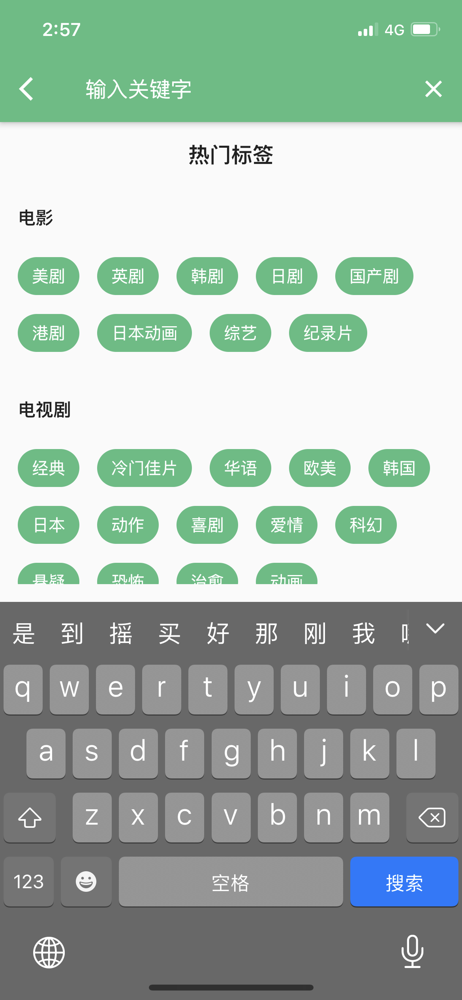

# Flutter Movies
一款基于豆瓣电影 Api 使用 Flutter 开发的移动端应用。
- Flutter: Channel stable, 1.22.3
- Dart: 2.10.3
- 运行环境：iOS 12.0 或以上（暂未适配 Android）

## 版本

| 版本 |  说明 |
| ----  | ---- |
| 1.0.0 | - |
| 1.1.0 | 默认语言改为简体中文 支持分享功能 支持分享功能 修复视频播放Bug 简化侧边栏 |
| 2.0.0 | 界面重构、优化 接口更新  |
| 2.1.0 | 支持搜索 支持图片、视频下载 支持视频全屏播放 |

## 预览

   

   

   

## 依赖库
- flutter_i18n
- cached_network_image
- dio
- provider
- package_info
- webview_flutter
- fluro
- pull_to_refresh
- shared_preferences
- photo_view
- video_player
- chewie
- share
- flutter_staggered_grid_view
- permission_handler
- image_gallery_saver
